# Semantic Search System

A full-stack Semantic Search application built using:

* Node.js + Express
* PostgreSQL + pgvector
* OpenAI Embeddings API
* OpenSearch
* DuckDB Analytics
* HTML/CSS/JavaScript Frontend

This project demonstrates:

* Vector embeddings generation
* Semantic similarity search
* Keyword search
* OpenSearch integration
* Analytical queries using DuckDB
* Frontend search UI
* PostgreSQL query optimization

---

# Features

## Semantic Vector Search

Search products using meaning instead of exact keywords.

Example:

* Searching `football shirt` returns `German soccer jersey`

## Keyword Search

Traditional SQL full-text search using PostgreSQL `tsvector`.

## OpenSearch Integration

Data synchronization and search support using OpenSearch.

## DuckDB Analytics

Analytical queries for:

* Revenue
* Sales count
* Reviews
* Returns

## Frontend UI

Simple frontend interface with:

* Search box
* Semantic search toggle
* Filters
* Result cards

---

# Tech Stack

| Technology  | Purpose                  |
| ----------- | ------------------------ |
| Node.js     | Backend Runtime          |
| Express.js  | API Server               |
| PostgreSQL  | Main Database            |
| pgvector    | Vector Similarity Search |
| OpenAI API  | Text Embeddings          |
| OpenSearch  | Search Engine            |
| DuckDB      | Analytics                |
| HTML/CSS/JS | Frontend                 |

---

# Project Structure

```text
project-root/
│
├── server.js
├── analytics.py
├── package.json
├── README.md
├── screenshots/
│   ├── frontend.png
│   ├── generate-embeddings.png
│   ├── vector-search-api.png
│   ├── frontend-search-empty.png
│   ├── frontend-vector-results.png
│   ├── postgres-query-results.png
│   ├── postgres-query-plan.png
│   ├── duckdb-results.png
│   ├── frontend-keyword-results.png
│   ├── frontend-semantic-results.png
│   ├── frontend-semantic-results-continued.png
│   ├── database-schema.png
│   ├── opensearch-running.png
│   ├── opensearch-setup-api.png
│   ├── opensearch-sync-api.png
│   └── opensearch-search-api.png
```

---

# Installation

## Clone Repository

```bash
git clone <your-repository-url>
cd <project-folder>
```

## Install Dependencies

```bash
npm install
```

## Install PostgreSQL Extensions

Enable:

* pgvector

SQL:

```sql
CREATE EXTENSION vector;
```

---

# Database Setup

## Create Items Table

```sql
CREATE TABLE items (
    id SERIAL PRIMARY KEY,
    title TEXT,
    description TEXT,
    embedding vector(768)
);
```

## Additional Columns

```sql
ALTER TABLE items
ADD COLUMN type TEXT,
ADD COLUMN search_vector tsvector,
ADD COLUMN color TEXT,
ADD COLUMN category TEXT,
ADD COLUMN price NUMERIC;
```

---

# Run Backend

```bash
node server.js
```

Server runs at:

```text
http://localhost:3000
```

---

# Generate Embeddings

API:

```text
http://localhost:3000/api/generate-embeddings
```

---

# Vector Search API

Example:

```text
http://localhost:3000/api/search/vector?q=football shirt
```

---

# OpenSearch Setup

## Run OpenSearch

```bash
docker compose up
```

OpenSearch runs at:

```text
http://localhost:9200
```

## Setup Index

```text
http://localhost:3000/api/opensearch/setup
```

## Sync Data

```text
http://localhost:3000/api/opensearch/sync
```

## Search Data

```text
http://localhost:3000/api/search/opensearch?q=football shirt
```

---

# DuckDB Analytics

Run:

```bash
python3 analytics.py
```

---

# Screenshots

## Backend Running

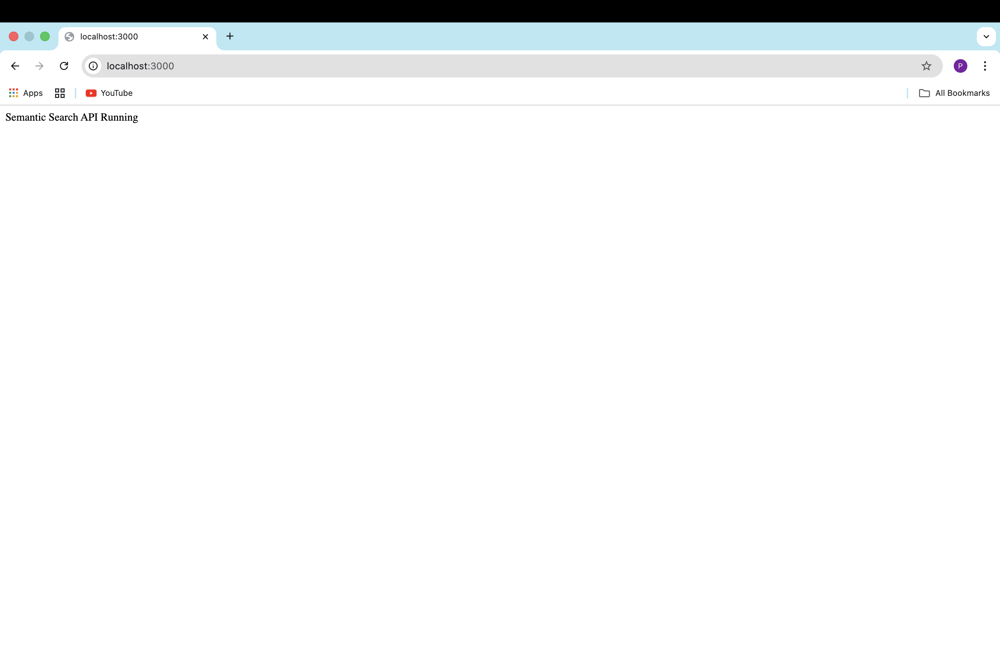

## Generate Embeddings API

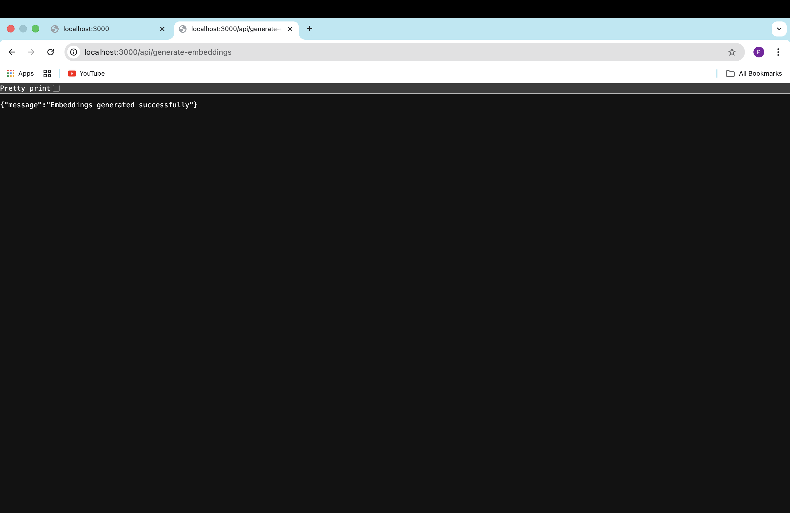

## Vector Search API

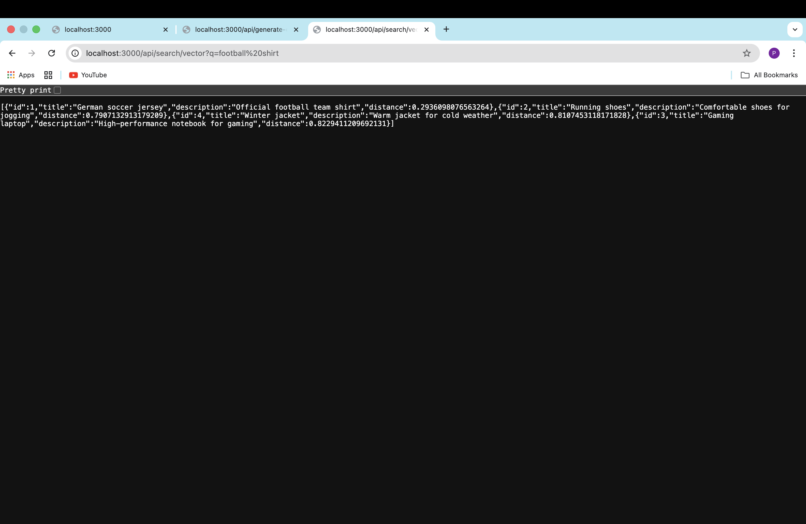

## Frontend Empty State

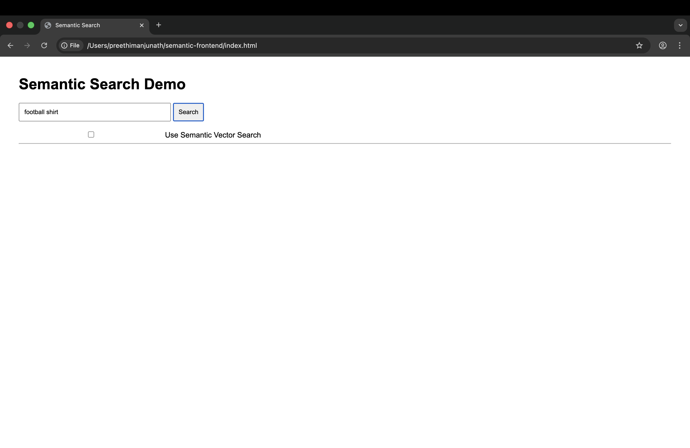

## Frontend Vector Search Results

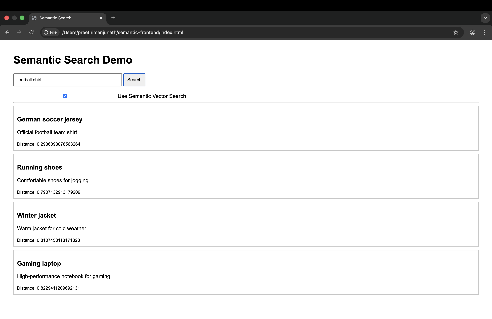

## PostgreSQL Query Results

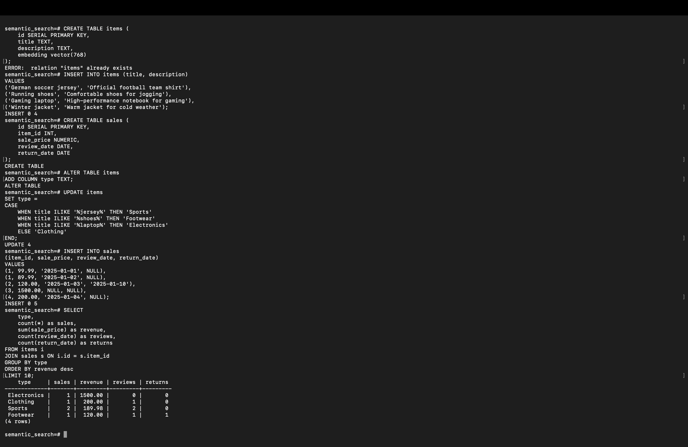

## PostgreSQL Query Plan

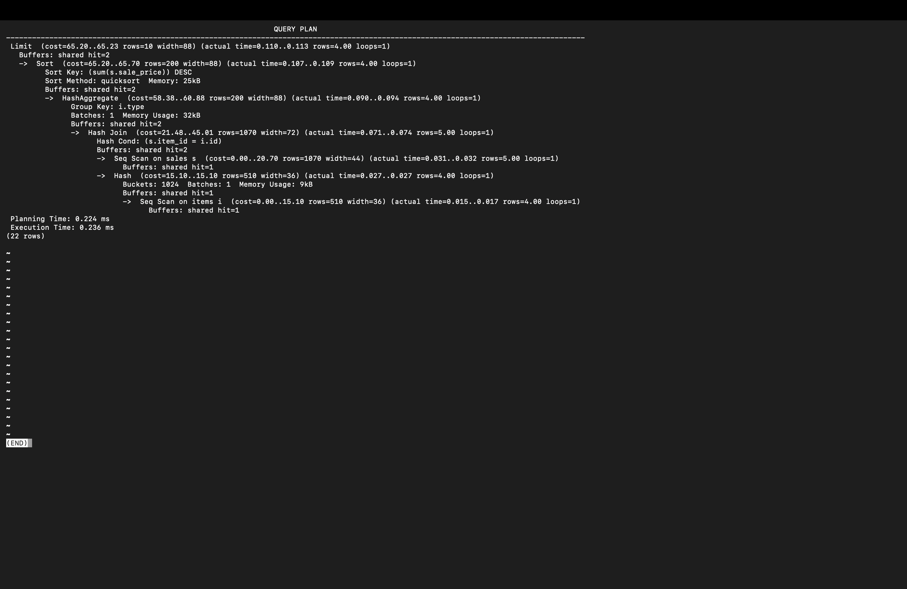

## DuckDB Analytics Results


## Frontend Keyword Search Results

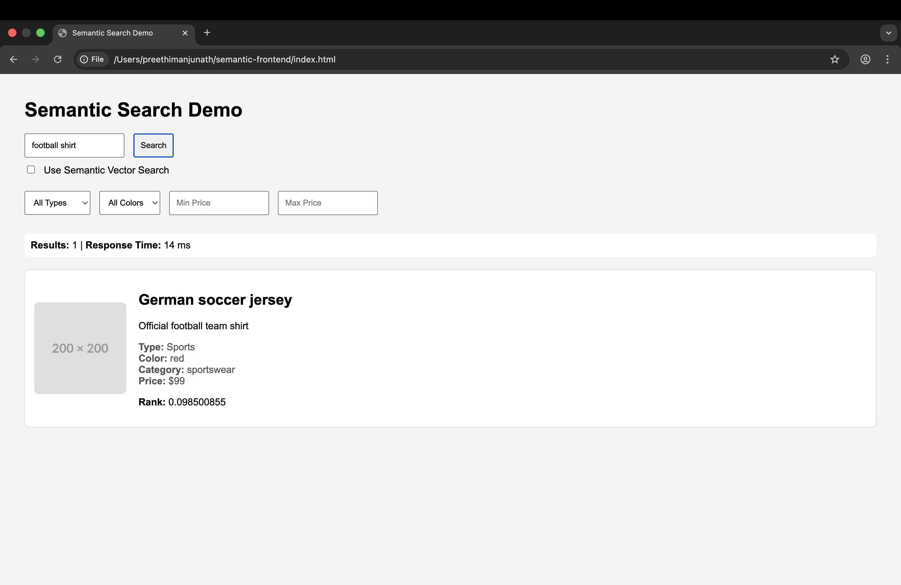

## Frontend Semantic Search Results

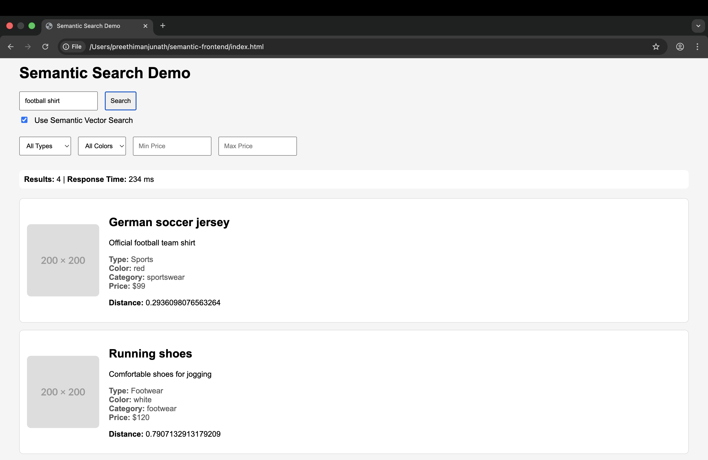

## More Semantic Search Results

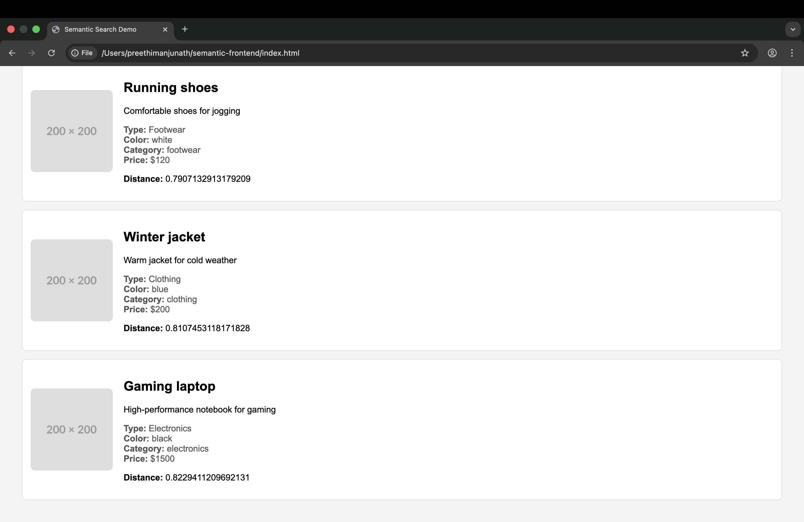

## Database Schema

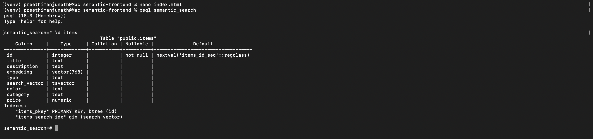

## OpenSearch Running

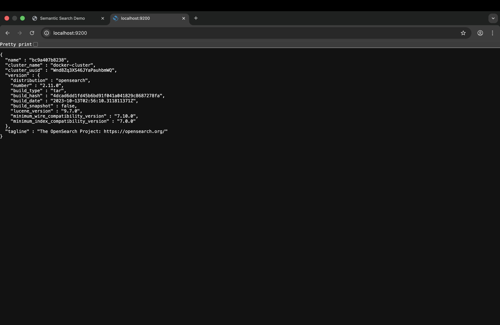

## OpenSearch Setup API

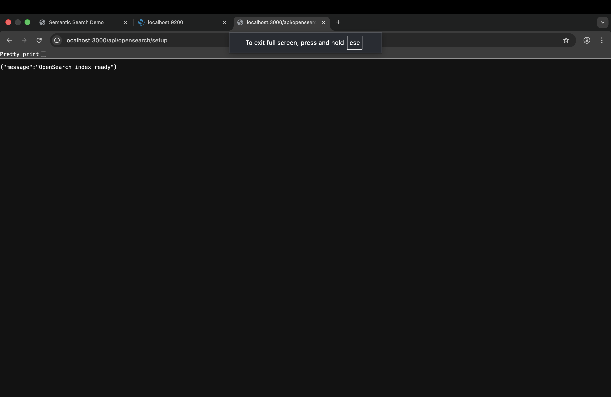

## OpenSearch Sync API

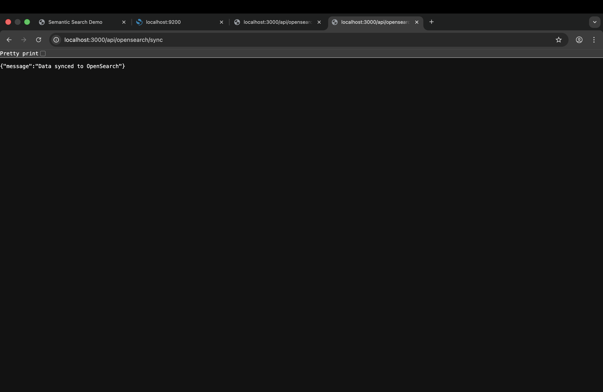

## OpenSearch Search API

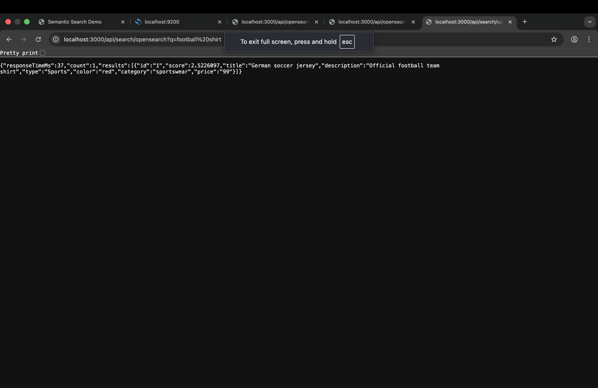

---

# Example Semantic Search

Input:

```text
football shirt
```

Result:

```text
German soccer jersey
```

This demonstrates semantic similarity instead of exact keyword matching.

---

# Future Improvements

* React frontend
* Better UI styling
* Image search support
* Hybrid ranking
* Authentication
* Real-time analytics dashboard

---

# Author

Preethi Chikkakalya Manjunath

